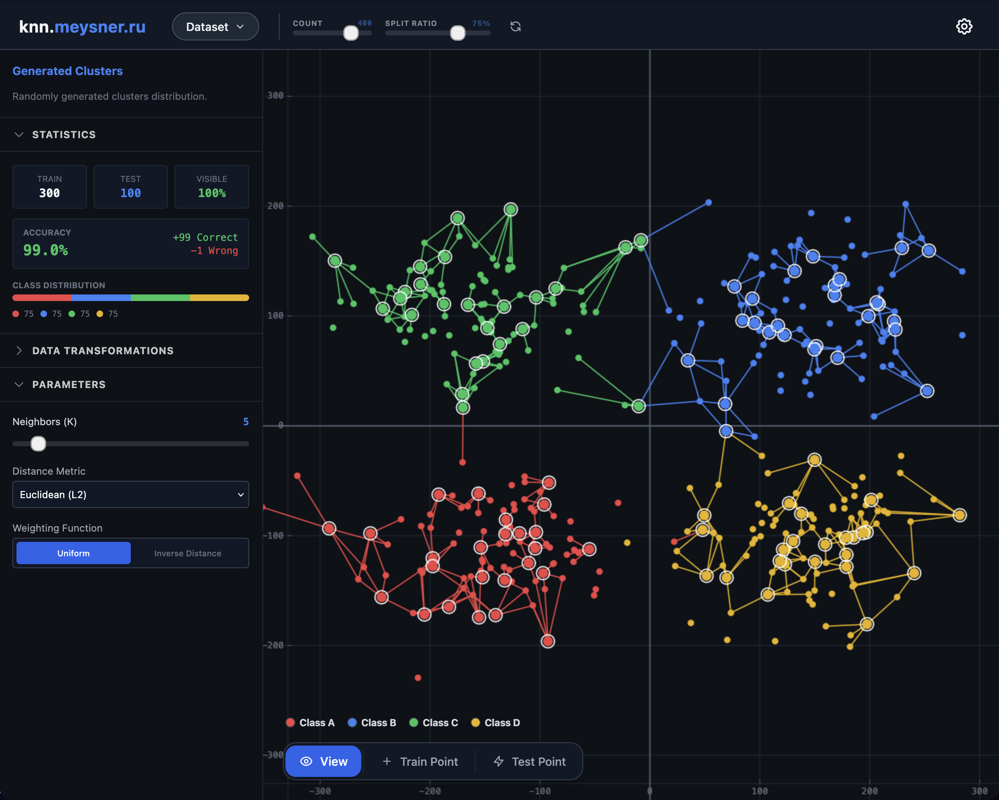
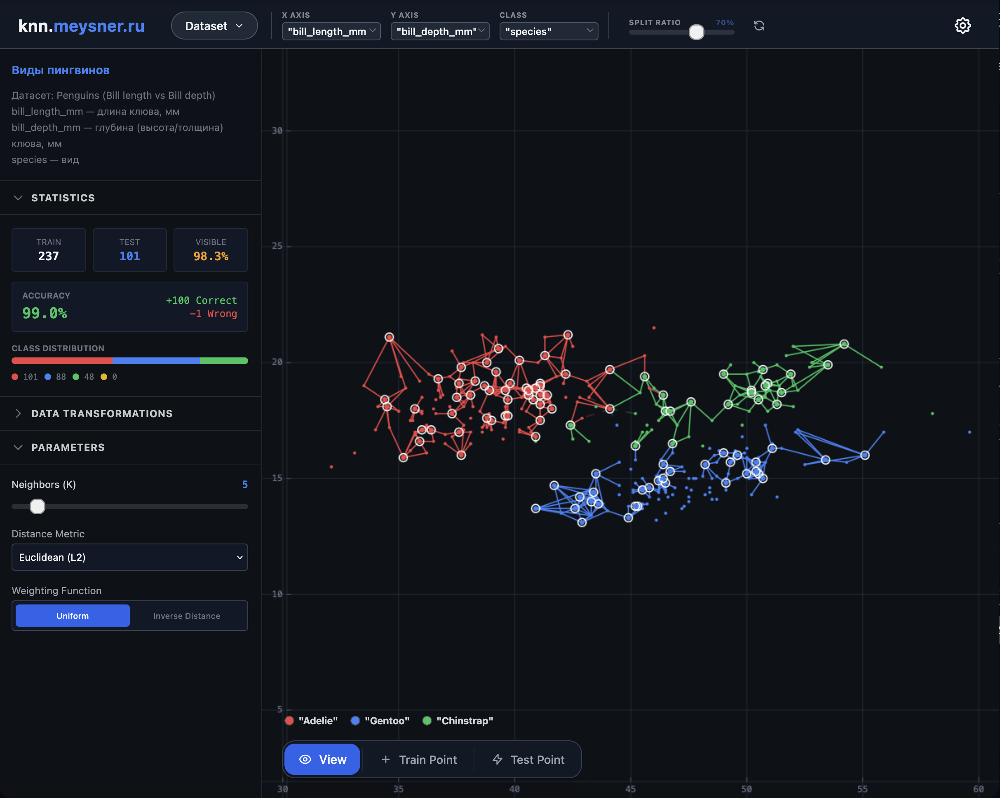
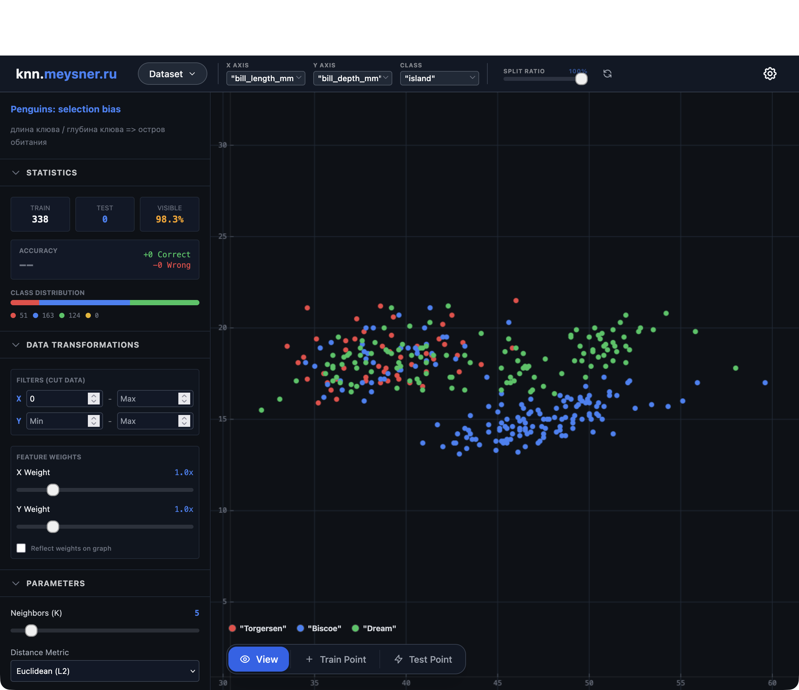

# Проект knn-studio


_Цель проекта_ - создание максимально гибкой и наглядной реализации алгоритма KNN, а также удобный интерфейс с высокой интерактивностью и наглядностью.

Далее, с примерами кода, я опишу реализацию алгоритма и частично покажу структуру файлов. Основное внимание будет уделено именно KNN — его устройству и работе. Остальные детали проекта я опущу.

## Реализация KNN

В данном приложении алгоритм реализован без использования сторонних библиотек в файле `services/knnLogic.ts`.

Все настройки алгоритма храняться в `App.tsx`, в конфиге

```typescript
// File: App.tsx
const [config, setConfig] = useState<KNNConfig>({
  k: 5, // Количество соседей
  metric: "euclidean", // Метрика (евклидова, манхэттен и т.д.)
  minkowskiP: 3, // P для Минковского
  weighting: "uniform", // Голосование (Uniform или Distance)
  weights: { x: 1, y: 1 }, // Веса осей (Feature Weights)
  visualizeWeights: false,
});
```

также хранятся и настройки данных, но отдельно в стейтах:

```typescript
// App.tsx
const [config, setConfig] = useState<KNNConfig>({
  // ...
  weights: { x: 1, y: 1 }, // Множители для осей
  visualizeWeights: false  // Галочка "Отразить веса на графике"
});
```

```typescript
// App.tsx
const [filters, setFilters] = useState<FilterState>({
    x: { min: undefined, max: undefined },
    y: { min: undefined, max: undefined }
});
```

Цикл работы алгоритма выглядит так:

- **State Update:** Любое событие изменяющее конфиг, допустим `Sidebar.tsx` обновляет состояние каког-то параметра или любое другое изменение данных(например добавление точки мышкой в канвасе)
- **Re-calculation:** В `App.tsx` срабатывает хук `useMemo` для переменной `classifiedPoints` - это запускает пересчет.
- **Iteration:** Для каждой точки типа **Test** (тестовая выборка) запускается функция `classifyPoint`.
- **Render:** Результат (предсказанный класс и список соседей) передается в `KNNCanvas` там мы используем библиотеку D3.js для отрисовки линий и цвета точки.

Разберем каждый блок настроек и соответствующий код в `knnLogic.ts`.

- Число соседей (K)
  - `classifyPoint` -> аргумент `k`.
- Метрика расстояния (Distance Metric)
  - Выпадающий список "Euclidean", "Manhattan", "Minkowski", "Cosine".
  - `calculateDistance` в `services/knnLogic.ts
- Функция взвешивания (Weighting Function)
  - Внутри цикла голосования в `classifyPoint`. Как соседи голосуют за класс: **Uniform (Равномерное)** Каждый из $K$ соседей имеет голос = 1. _Код:_ `votes[label] += 1;
  - **Inverse Distance (Обратное расстояние)** Ближайшие соседи имеют больший "вес" голоса. Один очень близкий сосед может перевесить 4-х далеких соседей другого класса.`
    ```typescript
    const weight = n.dist === 0 ? 10000 : 1 / (n.dist * n.dist);
    votes[label] += weight;
    ```

Вызов обновления "в коде":

```typescript
// File: App.tsx
const classifiedPoints = useMemo(() => {
  // ... фильтрация данных ... (именно предобработка данных)
  // Проходимся по всем тестовым точкам (newTest)
  const newTest = test.map((tp) => {
    const result = classifyPoint(
      //передаем все параметры конфига
      tp,
      train,
      config.k,
      config.metric,
      config.minkowskiP,
      config.weighting,
      weightsForLogic
    );

    return { ...tp, ...result };
  });

  return [...train, ...newTest];
}, [logicPoints, config]);
```

Формулы метрик

1. **Euclidean (Евклидова, L2):**
   Кратчайшее расстояние по прямой (гипотенуза).

$$ \sqrt{dx^2 + dy^2} $$
2. **Manhattan (Манхэттенская, L1):**
Сумма модулей разностей (движение по сетке улиц).
$$ |dx| + |dy| $$
3. **Minkowski (Минковского, Lp):**
Обобщение первых двух. Зависит от параметра $P$ (см. ниже).
$$ (|dx|^p + |dy|^p)^{1/p} $$

4. **Cosine (Косинусная близость):**
   Измеряет угол между векторами, а не длину. Игнорирует масштаб, важна только ориентация.
   $$ 1 - \cos(\theta) $$

## Логика разрешения спорных ситуаций:

Алгоритм работает батчами (порциями):

1. Берет первые $K$ соседей.
2. Считает голоса.
3. Если есть **чистый победитель** -> возвращает результат.

4. **Если ничья (Tie):**

- Алгоритм **не останавливается**. Он берет следующую партию из $K$ соседей (расширяет круг поиска). Смотрит, есть ли победитель теперь. Визуально на канвасе это отображается пунктирными линиями (дальние соседи, привлеченные для разрешения спора).

Цикл с учетом "Ничьей":

```typescript
// Cursor указывает, откуда начинать брать соседей (сначала 0)
let cursor = 0;
while (cursor < allNeighbors.length) {
  // Берем пачку из K соседей
  // Если K=5, берем [0..5], если была ничья, в след. круге возьмем [5..10]
  const batch = allNeighbors.slice(cursor, cursor + k);
  // --- ГОЛОСОВАНИЕ (Weighting Logic) ---
  const votes: Record<string, number> = {};

  batch.forEach((n) => {
    let weight = 1;

    // Если в сайдбаре выбрано 'Inverse Distance'
    if (weighting === "distance") {
      // Чем меньше дистанция, тем больше вес голоса (1 / dist^2)
      weight = n.dist === 0 ? 10000 : 1 / (n.dist * n.dist);
    }
    // Добавляем вес в копилку класса (например, "Class A" += 1.5)
    votes[n.point.label] = (votes[n.point.label] || 0) + weight;
  });

  // --- ОПРЕДЕЛЕНИЕ ПОБЕДИТЕЛЯ ---
  let winners: ClassLabel[] = [];
  // ... логика поиска максимума в объекте votes ...
  // Если победитель ровно один — мы закончили!
  if (winners.length === 1) {
    finalLabel = winners[0];
    break;
  }
  // Если победителей > 1 (НИЧЬЯ), цикл продолжается.
  // Мы увеличиваем курсор и на следующем витке возьмем следующих K соседей.
  cursor += k;
  hasTie = true; // Запоминаем, что была ничья (для отрисовки пунктира)
}
```

## Работа с данными

### Раздел DATA TRANSFORMATIONS в боковой панели

отвечает за Фильтрация (Filters) и Взвешивание признаков (Feature Weights) перед тем, как алгоритм KNN начнет свою работу

### Фильтры (Filters / Обрезка данных)

Эта функция позволяет исключить точки, которые выходят за пределы заданных диапазонов по осям X и Y. Это полезно для удаления выбросов или фокусировки на определенной области данных.

определяется

```typescript
// App.tsx
const [filters, setFilters] = useState<FilterState>({
    x: { min: undefined, max: undefined },
    y: { min: undefined, max: undefined }
});
```

и применяем внутри функции загрузки сырых данных applyDatasetState,приложение проверяет каждую точку на соответствие фильтрам.

```typescript
// App.tsx -> applyDatasetState

rawRows.forEach(r => {
    const xVal = parseFloat(r[xCol]);
    const yVal = parseFloat(r[yCol]);

    if (!isNaN(xVal) && !isNaN(yVal)) {
        // ...

        // ЛОГИКА ФИЛЬТРАЦИИ
        if (currentFilters.x.min !== undefined && xVal <= currentFilters.x.min) return; // Пропуск точки
        if (currentFilters.x.max !== undefined && xVal > currentFilters.x.max) return;
        if (currentFilters.y.min !== undefined && yVal <= currentFilters.y.min) return;
        if (currentFilters.y.max !== undefined && yVal > currentFilters.y.max) return;

        // Если проверки пройдены, точка добавляется в массив
        newPoints.push({
            id: r._id,
            x: xVal,
            y: finalY,
            // ...
        });
    }
});
```

Веса признаков (Feature Weights)
В KNN важность осей может быть разной. Если диапазон значений по оси X (0-1000), а по оси Y (0-1), то ось X будет доминировать при расчете евклидова расстояния. Веса позволяют сбалансировать это или принудительно усилить влияние одной из осей.

в когфиге

```typescript
// App.tsx
const [config, setConfig] = useState<KNNConfig>({
  // ...
  weights: { x: 1, y: 1 }, // Множители для осей
  visualizeWeights: false  // Галочка "Отразить веса на графике"
});
```

и применяется в формуле расчета дистанции services/knnLogic.ts. Разница координат умножается на вес до возведения в степень или взятия модуля.

```typescript
// services/knnLogic.ts

export const calculateDistance = (
  p1: DataPoint,
  p2: DataPoint,
  metric: MetricType,
  p: number = 2,
  weights: { x: number; y: number } = { x: 1, y: 1 } // Веса передаются сюда
): number => {
  // Применение весов к дельте координат
  const dx = Math.abs(p1.x - p2.x) * weights.x;
  const dy = Math.abs(p1.y - p2.y) * weights.y;

  switch (metric) {
    case 'manhattan':
      return dx + dy; // |dx*w_x| + |dy*w_y|
    case 'euclidean':
    default:
      return Math.sqrt(dx * dx + dy * dy); // sqrt((dx*w_x)^2 + (dy*w_y)^2)
  }
  // ...
};
```

## Теперь приведу пару примеров, датасет: "penguin dataset : The new Iris"

подгрузив данные мы видим сразу много настроек, мы можем изменять разбивку, переключать наши признаки, эксперементировать с параметрами алгоритма и моментально видить работу алгоритма


- здесь мы видим определение вида пингвина по обхавту и длине его клюва

изменив класы мы можем получить другую зависимость

здесь мы може видеть что с достаточно высокой вероятностью сможем узнать с какого острова пингвин по тем же признакам, но с условием что длина его клюва больше 44мм, июо менее


# Локальный запуск
## Развертывание и запуск

### Предварительные требования
*   **Node.js**: v18 или выше
*   **npm**: v9 или выше
*   **Docker** и **Docker Compose** (для контейнеризации)

### Локальный запуск (для разработки)

1.  **Установка зависимостей**
    Используйте `npm ci` для чистой установки зависимостей, зафиксированных в `package-lock.json`.

    ```bash
    npm ci
    ```

2.  **Запуск сервера разработки**
    Приложение запустится в режиме `dev` с горячей перезагрузкой (HMR).

    ```bash
    npm run dev
    ```
    
    По умолчанию приложение будет доступно по адресу: `http://localhost:3000` (порт может быть изменен в `vite.config.ts` или через переменную окружения `APP_PORT`).

3.  **Сборка для продакшена**
    Для создания оптимизированной сборки в папку `dist`:

    ```bash
    npm run build
    ```

    Для предпросмотра собранной версии:
    ```bash
    npm run preview
    ```

---

### Запуск через Docker

Проект содержит настроенный `Dockerfile` (multistage-сборка с Nginx) и `docker-compose.yml`.

1.  **Сборка и запуск контейнера**
    Команда соберет образ и запустит контейнер в фоновом режиме.

    ```bash
    docker-compose up -d --build
    ```

2.  **Доступ к приложению**
    Согласно конфигурации в `docker-compose.yml`, приложение будет доступно по адресу:
    
    `http://127.0.0.1:1324`

3.  **Настройка порта**
    Вы можете изменить порт хоста, передав переменную окружения `APP_PORT` перед запуском:

    ```bash
    APP_PORT=8080 docker-compose up -d
    ```
    *(В этом случае приложение будет доступно на порту 8080)*

4.  **Остановка**
    ```bash
    docker-compose down
    ```
